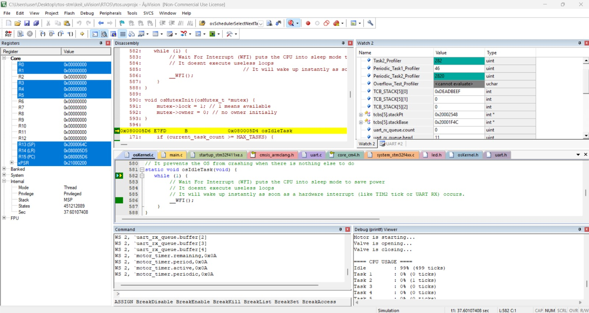

# Bare-Metal RTOS on STM32F411



A preemptive real-time kernel I wrote from scratch on an STM32F411RE (Cortex-M4, 16 MHz) to actually understand what happens inside an RTOS instead of just calling `xTaskCreate` and hoping for the best.

No HAL. No CMSIS-RTOS wrapper. Just registers, a linker script, and about 700 lines of kernel code that grew organically as I kept asking *"ok but what if two tasks both want the UART right now?"*

---

## What's Inside

The kernel is a single translation unit (`osKernel.c`) exposing a small C API (`osKernel.h`). Tasks are statically allocated TCBs linked in a circular list; SysTick drives context switches, `TIM2` drives everything time-related (sleeps, software timers, CPU accounting). Here's roughly what accumulated:

### Scheduling
Three modes, chosen at kernel init:
* **Priority:** Numerically lowest priority wins, ties broken by whoever the scheduler lands on first. Blocked and sleeping tasks are skipped automatically.
* **Round-robin:** Equal time slices, one quantum each, skip over anyone who can't run.
* **Cooperative:** Nobody preempts anyone; tasks yield when they feel like it.

The scheduler runs inside `SysTick_Handler`, which is a naked function because C compilers keep trying to be helpful with prologues that stomp on the saved context. Lesson learned the hard way.

### Sleep and Yielding
`osDelay(n)` parks the current task for `n` ticks. The counter is decremented from `TIM2_IRQHandler`, not SysTick — turns out `osThreadYield()` resets `SysTick->VAL`, which also clears the `COUNTFLAG`, which made sleep counts drift. Moving the decrement into an independent timer fixed it. `TIM2` runs at 100 Hz (10 ms/tick).

### Semaphores
Blocking counting semaphores. A task waiting on one isn't spinning — it's parked with `blockedOn` set, the scheduler refuses to pick it, and `osSemaphoreSet` clears the flag when the resource frees up. Zero CPU burn while waiting, which is the whole point.

### Mutexes with Priority Inheritance
Normal mutex with one extra trick: when a high-priority task blocks on a mutex held by someone lower, the owner's priority gets temporarily boosted to match. This prevents the classic priority inversion scenario that famously made the Mars Pathfinder keep rebooting itself. Original priority is stored in `basePriority` and restored on release.

### Queues (Ring Buffer)
Two variants, same internals:
* `osQueue_t`: Byte queue, used by the UART RX interrupt to stream characters to a consumer task without losing them to burst traffic.
* `osPtrQueue_t`: Pointer queue, used by the software timer service to hand expired timers from ISR context to the service task.

Non-blocking send (ISR-safe), blocking receive (sleeps on the internal semaphore).

### Software Timers
Because opening `while(1) { do_thing(); osDelay(100); }` tasks just to run a 100 ms callback felt wasteful. You register a callback with a period, and a dedicated service task runs it whenever it's due. Periodic or one-shot. The `TIM2` ISR walks the timer list each tick and dispatches expired ones into the pointer queue; the service task is highest priority so latency is a few ms at most.

Callbacks run in task context, not ISR context — so they can use mutexes, `printf`, `osDelay`, anything. This is the "Method B" implementation (FreeRTOS calls it the timer daemon). Method A would run callbacks directly in the ISR and then you can't do any of those things.

### Stack Overflow Detection
Every task stack gets `0xDEADBEEF` planted at its lowest address when created. On every context switch, the scheduler checks two things on the outgoing task:
1.  Has `SP` reached or crossed the canary address? *(active overflow)*
2.  Is the canary value still intact? *(past overflow)*

Either failure calls `osStackOverflowHandler`, which records the offending TCB in a global and halts with `__BKPT(0)` so the debugger picks it up. I verified it works by giving a test task a 2000-byte local array in a 1600-byte stack and watching the handler fire within two iterations.

### CPU Usage Accounting
Each TCB has a `runTicks` counter. In `TIM2_IRQHandler`, whoever `currentPt` points to at that moment gets credited with one tick. Over a five-second window that's 500 ticks to distribute; dividing gives a percentage. A periodic software timer prints a report to UART every five seconds:

```text
==== CPU USAGE ====
Idle         : 99% (498 ticks)
Task 1       : 0% (1 ticks)
Task 2       : 0% (0 ticks)
...
Total ticks  : 500
===================
```

99% idle is accurate — the workload is light and the tasks mostly sleep on delays and semaphores. Exactly the kind of headroom you want to see.

### Idle Task
Automatically added as task 0 with priority 255 (lowest). Its whole body is `while (1) { __WFI(); }` — wait for interrupt, literally puts the CPU to sleep until `TIM2` or some other interrupt wakes it. Free power savings.

---

## File Layout

```text
Src/
  osKernel.c    # The kernel, all of it
  main.c        # Demo app: motor, two valve tasks, UART listener, etc.
  uart.c        # USART2 init (TX polling, RX interrupt)
  led.c         # PA5 LED driver (barely used, but it's there)
Inc/
  osKernel.h    # The public API
  uart.h
  led.h
RTE/            # CMSIS device headers and the startup assembly
rtos.uvprojx    # Keil uVision 5 project
screenshots/    # Kernel running in the debugger
```

---

## Demo Application

`main.c` wires up a little fake industrial-control scenario:

* A **software timer** prints *"Motor is starting..."* every 100 ms. (Used to be `task0` with its own stack; software timers replaced it to save 1600 bytes and a TCB slot.)
* **task1** and **task2** ping-pong via two semaphores, one opening the valve and one closing it. They share the UART via `print_mutex`.
* **task4** blocks on the UART RX queue and reacts to commands: `O` opens the valve, `C` closes it. Everything in between is ignored.
* A **test task** simulates UART bursts by injecting five characters back-to-back every two seconds — proves the RX queue actually preserves bursts, which a single-variable `latest_rx_data` would lose.
* The **CPU reporter timer** fires every 5s and prints the usage table.

On real hardware the test task would go away and the USART2 ISR would feed the queue directly. In the Keil simulator, the emulated USART2 generates phantom `RXNE` events, so bypassing it was cleaner for development.

---

## Building

1.  Open `rtos.uvprojx` in Keil uVision 5 (v5.39+).
2.  Pick the **Simulator** target under `Options -> Debug`.
3.  Build and Run. 
4.  The `printf` output lands in the **Debug (printf) Viewer** via ITM.

*Tested only with ARM Compiler 6 (armclang). No floating-point code, no C library dependencies beyond `printf`.*

---

## A Note on Hardware vs. Simulation

Full disclosure: This kernel was developed and tested **entirely within the Keil uVision Simulator**. It has not been flashed to a physical STM32F411RE board yet. 

While the register configurations, memory maps, and interrupt vectors are written strictly for the actual silicon, the primary goal of this project was to understand the *software architecture* of an RTOS (context switching, scheduling, IPC, memory safety) rather than perfecting hardware integration. 

If you decide to flash this onto a real Nucleo board, keep in mind that you might need to tweak some hardware-specific behaviors (like clock initializations or dealing with real-world UART noise instead of the simulator's clean environment).

---

## Reference Documentation

Writing an RTOS without HAL means spending a lot of time staring at PDFs. If you are trying to understand the register-level configurations in this code, these are the official documents used during development:

* **[STM32F411 Reference Manual (RM0383)](https://www.st.com/resource/en/reference_manual/dm00119316-stm32f411xce-advanced-armbased-32bit-mcus-stmicroelectronics.pdf):** The ultimate guide for the peripherals. Used extensively for configuring the RCC (clocks), GPIO alternate functions, USART2, and the TIM2 hardware timer.
* **[Cortex-M4 Generic User Guide (DUI0553)](https://developer.arm.com/documentation/dui0553/latest/):** Essential for the core CPU features. Used for understanding the SysTick timer, the NVIC (Nested Vectored Interrupt Controller), and the exact register stacking/unstacking behavior required to write the naked context switch assembly.
* **[STM32F411RE Datasheet](https://www.st.com/resource/en/datasheet/stm32f411re.pdf):** Used primarily for the specific pinout definitions (e.g., confirming that `UART2_RX` maps to `PA3` and uses Alternate Function 7).

---

## A Note On How This Started

The project started from Israel Gbati's excellent Udemy course, [RTOS: Building from the Ground Up on ARM Processors](https://www.udemy.com/course/rtos-building-from-ground-up-on-arm-processors/). The first few primitives (the round-robin scheduler, the initial stack frame layout, the naked context switch) follow its structure closely because there's really only one sensible way to do that on a Cortex-M.

Everything after that — priority scheduling, priority inheritance, the queue variants, software timers, stack canaries, CPU accounting, the `TIM2` decoupling from SysTick, the idle task — grew out of bumping into problems while building the demo and figuring out how to fix them. Debugging a stuck priority inversion by staring at `currentPt` in Keil's Watch window is how you really learn what a mutex is.

## License

Personal learning project, no formal license. If you find something useful here, take it.